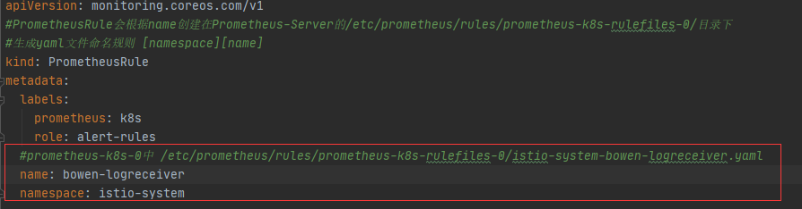
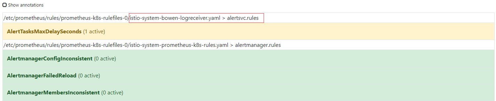
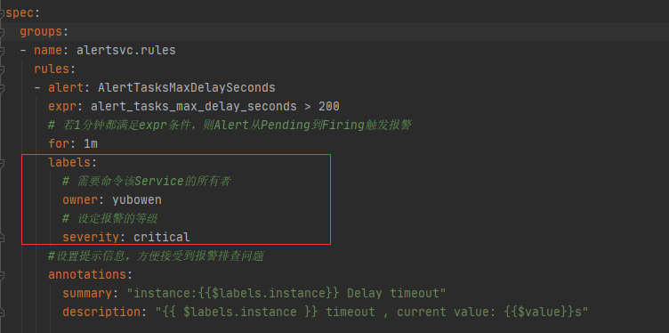

# Dev 创建Service的PrometheusRule
- **注意事项1**： PrometheusRule的name唯一

    
    开发者编写自己Service的PrometheusRule需要保证name唯一,建议使用create而不是apply避免覆盖他人规则
    
    效果展示图：

- **注意事项2**： groups.labels需要设定owner标签

查看PrometheusRule_Alertsvc.yaml的labels


# 部署
```shell script
# 建议使用create创建PrometheusRule，避免屏蔽他人告警规则
kubectl create -f PrometheusRule_Alertsvc.yaml
```