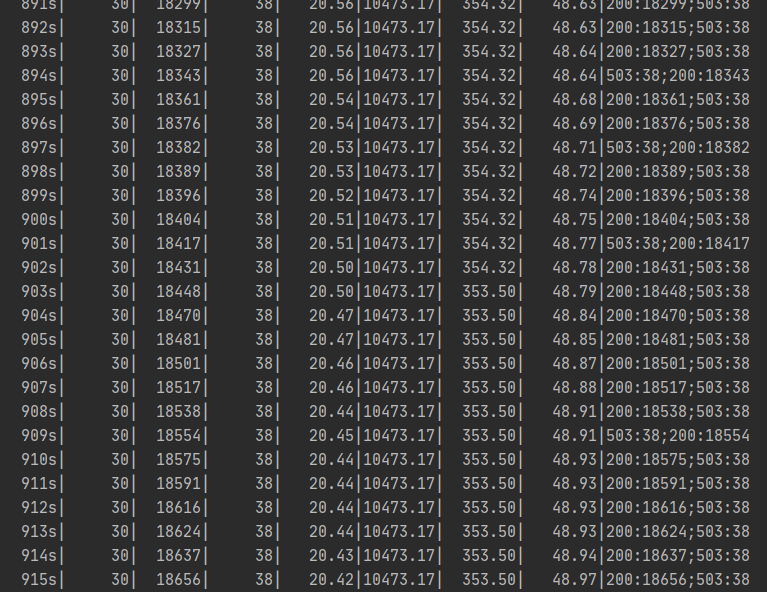

# uwsgi 
:smile: :smile: :smile: :smile: :smile: :smile: :smile: :smile: :smile: :smile: :smile: :smile: :smile: :smile: :smile: :smile: :smile: :smile: :smile: :smile: :smile: :smile: :smile: :smile: :smile: :smile:
## Zero-Dowentime-Test
### 目的 + 结论
目的：Zero Downtime Rolling Updates With Kubernetes

结论：最终通过双探针, **preStop(核心配置)** 的设置，可实现Zero Downtime目标。且通过实验证明并不会影响Rolling Updates的时间，[原因可看此章节](../../README.md#二-控制滚动升级速率)。
### 测试工具
[go-test](https://github.com/link1st/go-stress-testing)
- 该工具实时刷新，可动态查看错误状态码

### 测试方式：同时测试/api/,/api/sleep,两个接口观察状态码动态变化
- 测试/api/接口，命令1：`go run .\main.go -c 50 -n 100000 -u http://<your server address>/api/`
- 测试/api/sleep接口，命令2：`go run .\main.go -c 50 -n 100000 -u http://<your server address>/api/sleep`
### 测试用例
1. [uflask-deployment-v1](../uwsgi/uflask-deployment-v1.yaml): {v1:no livenessProbe, readinessProbe, lifecycle}
2. [uflask-deployment-v2](../uwsgi/uflask-deployment-v2.yaml): {v2:Configure livenessProbe, readinessProbe but not lifecycle}
3. [uflask-deployment-v3](../uwsgi/uflask-deployment-v3.yaml): {v3:Configure livenessProbe, readinessProbe, lifecycle}
4. [uflask-deployment-v4](../uwsgi/uflask-deployment-v4.yaml): {v4:Configure livenessProbe, readinessProbe, lifecycle}
5. [uflask-deployment-v5](../uwsgi/uflask-deployment-v5.yaml): {v5:Configure livenessProbe, readinessProbe, lifecycle, sidecar}
6. [uflask-deployment-v6](../uwsgi/uflask-deployment-v6.yaml): {v6:Configure livenessProbe, readinessProbe, lifecycle, sidecar}
### 报告
**说明**：**下面每组图，第一张图是接口/api/，第二张图是接口/api/sleep(延迟1s)**

字段分别是：| 耗时 │ 并发数 │ 成功数 │ 失败数 │ qps │ 最长耗时 │ 最短耗时 │ 平均耗时 │ 错误码 |

**下面的时间记录按第一张图计算**
1. 滚动升级180s开始，205s结束v1->v2（v2配置双探针），出现29个503，证明在pod在Termination状态依然有流量进入:
    
     
    
    
2. 滚动升级445s开始，477s结束v2->v3（v3配置双探针加生命钩子），出现新的7个503，因为preStop是在容器结束时生效，所以依然有503出现:
    
     
    
    
3. 滚动升级610s开始，640s结束v3->v4（v4配置双探针加生命钩子），没有出现新的503，因为pod在`Terminating`状态持续等待的20s过程中仍可处理意外进入的流量：
    
     
    
    
4. 滚动升级866s开始，900s结束v4->v5（v5配置双探针,生命钩子,sidecar）: 
    
     
    
    
5. 滚动升级1050s开始，1082结束v5->v6（v6配置双探针,生命钩子,sidecar）: 
    
     
    
    