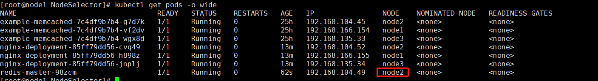

# 给Node打上标签
```shell script
kubectl label nodes <node-name> <label-key>=<label-value>

kubectl label nodes node2 zone=north
```
# nodeSelectorTerms,matchExpressions
- nodeSelector和nodeAffinity，必须同时满足

NodeAffinity中：
- **多个nodeSelectorTerms，匹配1个即可**
- **多个matchExpressions需要同时满足**


# 创建rc,利用
```shell script
kubectl create -f nodeSelector.yaml

kubectl get pods -o wide
```

